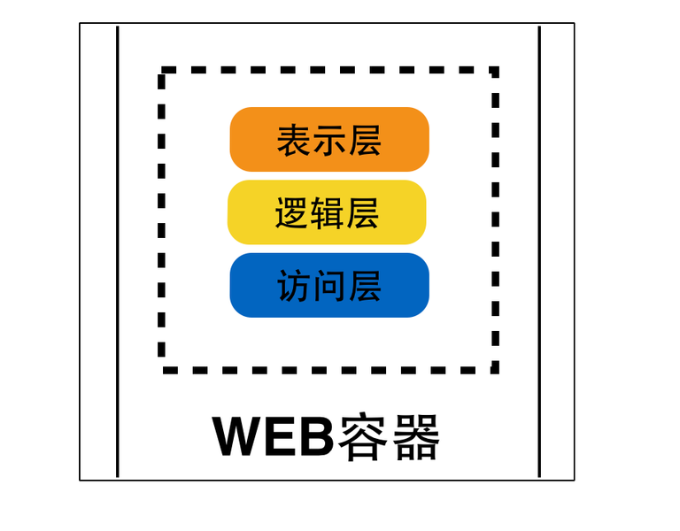

   典型的单块架构应用，莫过于传统的J2EE项目所构建的产品或者项目，它们存在的形态一般是WAR包或者EAR包。当部署这
类应用时，通常是将整个一块都作为一个整体，部署在同一个WEB容器，如Tomcat或者Jetty中。当这类应用运行起来后，所有的功能也都运行在同一个进程中。

   类似的，基于Ruby On Rails的单块架构应用，一般逻辑上分为控制器层、模型层以及视图层，同时代码存放在遵循一定层级结构 的目录中
。当部署这类应用的时候，通常是使用SSH或者其他一些工具，如[Capistrano](https://github.com/capistrano/capistrano)将整个目录部署在[Passenger](https://www.phusionpassenger.com/)或者其他WEB容器中。当这类应用运行起来后，所有的功能也都运行在同一个进程中。

因此，对于单块架构应用的定义，其实是基于分层软件架构设计的系统基础之上，从部署模式、运行模式角度去考虑的一种定义方式。