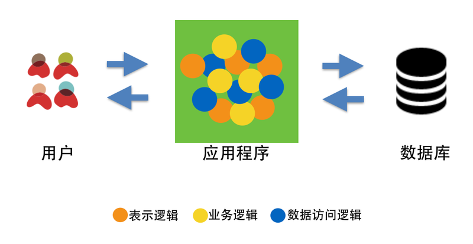
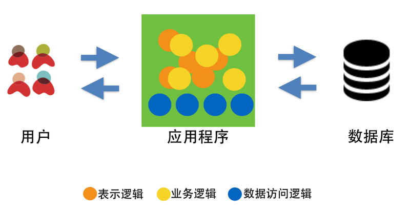

# 三层应用架构的发展

对于任何一个软件应用系统而言，其构建目标都是为了满足某类用户的需求，即为用户传递价值。一直以来，软件的架构设计是决定应用系统是否能够被正确、有效实现的关键要素之一。架构设计描述了在应用系统的内部，如何根据业务、技术、组织，以及灵活性、可扩展性、可维护性等多种因素，将应用系统划分成不同的部分，并使这些部分彼此之间相互分工、相互协作，从而为用户提供某种特定价值的方式。

## 三层应用架构

   现实生活中，“层”这个字的含义，对大家一点都不陌生。我们经常说楼房高多少层，蛋糕有几层等。通常来说，层有好几种定义，但其中最耳
熟能详的，莫过于“层”能帮助我们划分出构成某整体事物的，上下相互支撑的的不同部分。譬如说，我们喜欢吃的蛋糕，一般是由三层组成：第一层的蛋糕体、第二层的奶油，和第三层的水果。从顶部至底部，每一层依赖于下一层，从底部到顶部，每一层又支撑着上一层。

   在软件架构模式的领域，经过多年的发展，也有了层的概念：

   * 层能够被单独构造；
   * 层具有区别于其他层的显著特点；
   * 层与层之间能够互相连接、互相支撑、互相作用，相互协作构成一个整体。
   * 层的内部，可以被替换成其他可工作的部分，但对整体的影响不大。

   以WEB应用程序为例，在WEB应用程序开发的早期，由于受到面向过程的思维及设计方式的影响，所有的逻辑代码并没有明显的区分，因此代码
之间的调用相互交错，错综复杂。譬如，我们早期使用的ASP、JSP以及PHP，都是将所有的页面逻辑、业务逻辑以及数据库访问逻辑放在一起，这是我们通常提到的一层架构。

   随着JAVA，.NET等高级语言的快速发展，这些语言为开发者提供了越来越方便的的数据访问机制，如Java语言的JDBC、IO流，或者.NET的ADO.NET等。这时候，数据访问部分的代码逐渐有了清晰的结构，但表示逻辑和业务逻辑依然交织在一起，我们称这个阶段为二层架构阶段。

   随着面向对象分析、面向对象设计、面向对象原则、设计模式、企业架构模式等理念以及方法论的不断发展，从为用户提供功能、以及有效组织软件结构的角度考虑，WEB
应用中不同职责的部分逐渐被定义在了不同的层次，每一层负责的部分更趋向于具体化，细致化，于是软件的三层架构逐渐出现了。三层架构通常包括表示层、业务逻辑层以及数据访问层。

   - 表示层

   表示层部分通常指当用户使用应用程序时，看见的、听见的、输入的或者交互的部分。譬如，有可能是信息的显示，音乐的的播放或者可以输
入的文本框，单选按钮以及可点击的按钮等。通过这些元素，用户同软件进行交互并获取期望的价值。目前的用户接口大部分情况下为WEB方式，当然也可以是桌面软件的形式，例如. NET的WINFORM或者Java的SWING。

   - 业务逻辑层

   业务逻辑部分是根据用户输入的信息，进行逻辑计算或者业务处理的部分。业务逻辑层则主要聚焦应用程序对业务问题的逻辑处理，以及业务
流程的操作，它是大部分软件系统区别与其他系统的核心。譬如，当用户点击一个按钮后，它可能会触发业务逻辑部分的代码进行运算，生成用户期望的结果。举例来说，在一个电子商务平台中，作为用户，当我们下单购买某个商品后，应用程序的业务逻辑层会对订单如何进行处理，如何计算折扣、如何配送等进行处理。

   - 数据访问层

  在用户同应用程序交互的过程中，会产生数据。这类数据需要通过某种机制被有效的保存，并在将来能够被重复使用，或者提供给其他系统。这
种机制或者方法就是数据访问层最关注的部分。也就是说，它关注的是应用程序是如何有效的将数据存储到数据库、文件系统或者其他存储介质中。有一点要注意的是，它关心的是对原始数据的操作（数据库或者文本文件等存放数据的形式），而非原始数据的存储介质本身。譬如，在一个电子商务平台中，商品的信息是如何存储，图片的信息是如何获取的等。

   
   ## 三层应用架构   

三层架构的出现，一方面是为了解决应用程序中代码间调用复杂、代码职责不清的问题。其通过在各层间定义接口，并将接
口与实现分离，可以很容易的用不同的实现来替换原有层次的实现，从而有效降低层与层之间的依赖。这种方式不仅有利于帮助团队理解整个应用架构，降低后期维护成本，同时也有利于制定整个应用程序架构的标准。

   另一方面，三层结构的出现从某种程度上也解决了企业内部如何有效的根据技能调配人员，提高生产效率的问题。在大环境
下，有效的分层能使不同职责的人员各司其职，更聚焦与个人专业技能的发展和培养。三层结构的出现不仅标准化了复杂系统的逻辑划分，更帮助企业解决了如何有效形成技术人员组织结构的问题，因此在很长的一段时间里，它一直是软件架构的经典模式之一。
