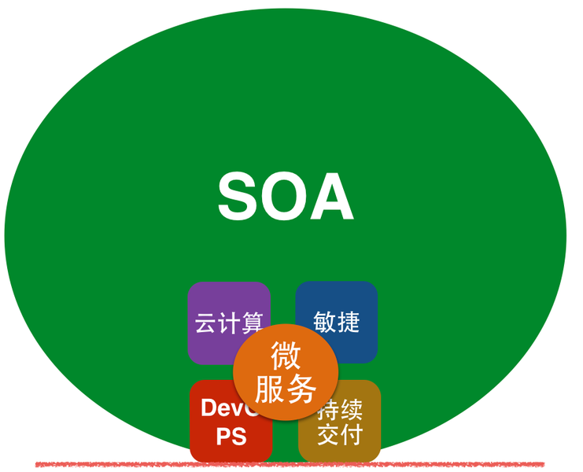

# 什么是微服务架构

实际上，微服务架构并不是一个全新的概念。早在1996年，Gartner就提出面向服务架构（SOA）。2002年，SOA更是成为"现代应用开发领域最重要的课题之一"。面向服务架构的提出，阐述了“对于复杂的企业IT系统，应按照不同的、可重用的粒度划分，将功能相关的一组提供者组织在一起为消费者提供服务”。仔细分析SOA的概念，就会发现，我们今天所谈到的微服务的概念和传统的SOA思想几乎类似。那在SOA诞生这么多年后，为什么又提出了微服务架构呢？

其实，鉴于过去十几年互联网行业的高速发展，以及敏捷、持续集成、持续交付、DevOPS，云技术等的深入人心，服务架构的开发、测试、部署以及监控等，相比我们提到的传统的SOA的服务实现的方式，已经大相径庭。

相比传统SOA的服务实现方式，微服务更具有独立性、灵活性、可实施性以及可扩展性，其更强调的是一种独立测试、独立部署、独立运行的软件架构模式。换句话说，微服务架构是SOA的一种实现，是一种更符合现代互联网发展趋势的面向服务架构（SOA）实现，是一种更容易帮助企业或组织构建高响应力架构的方法和实践。

