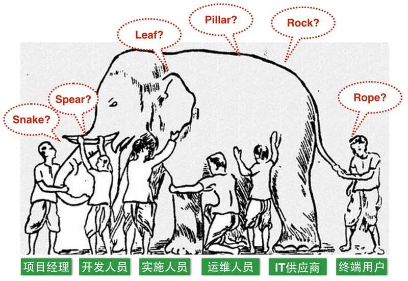
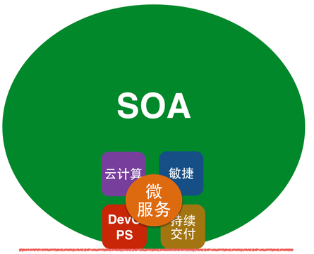

# 微服务架构与SOA

## SOA简述

早在1996年，Gartner就提出面向服务架构（SOA）。SOA阐述了“对于复杂的企业IT系统，应按照不同的、可重用的粒度划分，将功能相关的一组功能提供者组织在一起为消费者提供服务”，其目的是为了解决企业内部不同IT资源之间无法互联而导致的信息孤岛问题。

2002年，SOA被称作"现代应用开发领域最重要的课题之一"，其正在帮助企业从资源利用的角度出发，将IT资源整合成可操作的、基于标准的服务，使其能被重新组合和应用。

但是，由于SOA本身的广义性以及抽象性，在其诞生的相当长一段时间内，人们对SOA存在着不同的认知和理解。

直到2000年左右，ESB、WebService、SOAP等这类技术的出现，才使得SOA渐渐落地。同时，更多的厂商像IBM、Oracle等也分别提出基于SOA的解决方案或者产品。

## 微服务与SOA

实际上，微服务架构并不是一个全新的概念。仔细分析SOA的概念，就会发现，其和我们今天所谈到的微服务思想几乎一致。那在SOA诞生这么多年后，为什么又提出了微服务架构呢？

鉴于过去十几年互联网行业的高速发展，以及敏捷、持续集成、持续交付、DevOPS，云技术等的深入人心，服务架构的开发、测试、部署以及监控等，相比我们提到的传统的SOA实现，已经大相径庭，主要区别如下表所示：

SOA实现 | 微服务架构实现 |
----|----------|
企业级，自顶向下开展实施|团队级，自底向上开展实施|
服务由多个子系统组成，粒度大|一个系统被拆分成多个服务，粒度细|
企业服务总线，集中式的服务架构|无集中式总线，松散的服务架构|
集成方式复杂（ESB/WS/SOAP）|集成方式简单（HTTP/REST/JSON）|
单块架构系统，相互依赖，部署复杂|服务都能独立部署|

相比传统SOA的服务实现方式，微服务更具有灵活性、可实施性以及可扩展性，其强调的是一种独立测试、独立部署、独立运行的软件架构模式。

## 小结

综上所述，对于微服务的概念而言，它是传统SOA的定义的一个子集；而对于其实现方式而言，它是一种更符合现代化互联网发展趋势的实践，是一种更容易帮助企业或组织有效并成功实施服务架构的实践。

