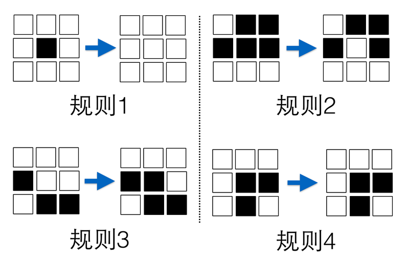

#多‘微’的服务才叫微服务

微服务架构通过对特定业务领域的分析与建模，将复杂的应用分解成小而专一、耦合度低并且高度自治的一组服务，每个服务都是很小的应用。那么，微服务中提到的‘微’，到底是个什么样的‘微’呢？


实际上，关于多微的服务才合适，是一个非常有趣的话题。有人觉得使用代码行数来作为‘微’的衡量标准比较合适，而有些人认为，既然是微服务，就应该简单，应该在很短的时间内，譬如2周内，能够容易的重写该服务，这样才符合微的观念。

## 代码行数？

我们知道，不同的语言有不同的特点。

静态类型语言的主要优点在于其结构规范，存在编译期的语法检查、便于调试，类型安全性高，通常其继承关系简洁明了，IDE对其支持也更加友好；但其缺点是为此需要写更多的类型相关代码。因此如果要实现同样的功能，代码量相对稍多，这类语言的典型代表有Java、C++等；

动态语言，其灵活性较高，运行时可以改变内存结构，无类型检查，无需写较多的类型相关的代码；但缺点是不方便调试，无编译器检查，因此对个体的能力要求较高。尤其是项目复杂度高或者代码量较大的项目，如果没有足够高的测试覆盖率，维护起来更是举步维艰，是一把典型的双刃剑。典型的代表如JavaScript、Ruby或者Python等。

譬如说，对于经典的[康威生命游戏](http://zh.wikipedia.org/wiki/%E5%BA%B7%E5%A8%81%E7%94%9F%E5%91%BD%E6%B8%B8%E6%88%8F)而言，游戏开始时，细胞随机的被指定为存活或者死亡状态（黑色表示存活，白色表示死亡），每个细胞都会不断的演进，并且在演进的过程中，每个细胞下一代的状态由该细胞当前周围8个细胞的状态所决定，其具体的规则如下图所示：

  * 规则1，如果一个细胞周围有少于2个存活细胞，则该细胞无论存活或者死亡，下一代将死亡；

  * 规则2，如果一个细胞周围有多于3个存活细胞，则该细胞无论存活或者死亡，下一代将死亡；

  * 规则3，如果一个细胞周围有3个存活细胞，则该细胞下一代将存活；

  * 规则4，如果一个细胞周围且仅有2个存活细胞，则该细胞下一代状态保持不变；



对于这个问题，感兴趣的读者，可以尝试使用自己最擅长的语言来解决这个问题。对于一般的静态语言，

但这里，我想说的是，有一种语言叫APL（[A Programing Language](http://en.wikipedia.org/wiki/APL_\(programming_language\))），如果我们使用它来实现，需要如下一行代码就可以解决该问题。

```
life←{↑1 ⍵∨.∧3 4=+/,¯1 0 1∘.⊖¯1 0 1∘.⌽⊂⍵}

```

因此，对于实现同样的功能，选择不同的语言，代码的行数会有千差万别。因此代码行数这种量化的数字显然无法成为衡量微服务是否够‘微’的决定因素。


## 重写时间？

另外，有些人认为，既然是微服务，就应该简单。譬如说，就应该在很短的时间内（譬如2周），能容易的重写旧服务，这样才符合‘微’的概念。

实际上，同样的周期，对于不同的个体而言，结果可能不尽相同。我们知道，对于功能的替换或者重写，很大程度取决于个体成员的工作经验、擅长语言、对业务背景的了解等等。譬如说，工作年限长的开发者通常情况下对其擅长的语言更熟练；而对业务理解较好的开发者，也能在更短的时间内完成重写。

因此，多长时间能够重写该服务也不能作为衡量其是否小的重要因素。

## 团队觉得好才是真的好

微服务的‘微‘并不是一个真正可衡量、看得见、摸得着的微。这个‘微‘所表达的，是一种设计思想和指导方针，是需要团队或者组织共同努力找到的一个平衡点。

所以说，微服务到底有多微，是个仁者见仁，智者见智的问题，最重要的是团队觉得合适就好。

但注意，如果达成‘团队觉得合适就好’的结论，至少还应该遵循两个基本前提：

业务独立性和团队自主性。

首先，应该保证微服务是具有业务独立性的单元，并不能只是为了微而微。关于如何判断业务的独立性，也有不同的考量。譬如，可以将某一领域模型作为独立的业务单元，譬如订单、产品、合同等；也可以将某业务行为作为独立的业务单元，譬如发送邮件、单点登录验证、不同数据库之间的业务数据同步等。更多关于业务建模与划分的资料，请参考Eric Evans的《领域驱动模型》一书。

其次，考虑到团队的沟通及协作成本，一般不建议超过10个人。因为从笔者敏捷的实践来看，当团队超过10个人，在沟通、协作上所耗费的成本会显著增加。或者，在超过10个人的团队中，可以继续再划分子团队，让不同的子团队承担独立的工作，这也是笔者在实践中通常采用的做法。除此之外，团队应该由不同技能、不同角色的成员组成，是一个全功能的团队。

## 总结

微服务的‘微’并不是一个真正可衡量、看得见、摸得着的微。这个’微’所表达的，是一种设计思想和指导方针，是需要团队或者组织共同努力找到的一个平衡点。