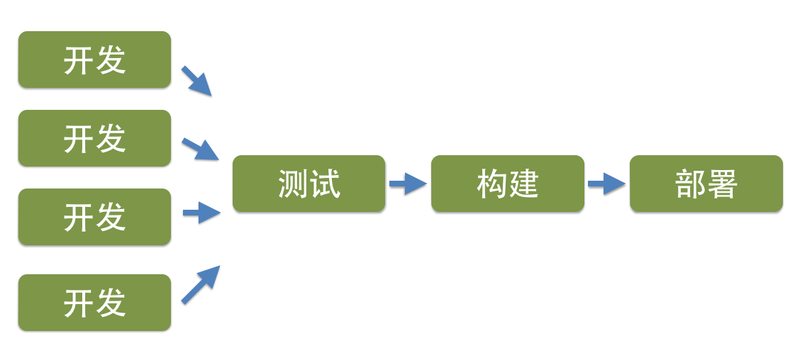

#松耦合，独立部署
    

## 单块架构

在传统的单块架构应用里，由于所有的功能都存在同一个代码库里。因此，当修改了某个功能，在测试覆盖率不够高的情况下，很容易出现多个功能之间的相互影响，尤其是随着代码量、功能的增加，风险也会大幅增加。换句话说，功能和功能之间存在着强耦合关系。

不同功能集成完毕后，必须在测试过程中完成回归测试，才能确保对现有系统的功能不会造成影响。

当回归测试完毕后，通过持续集成或者其他机制，构建部署包。

将部署包部署到生产环境或者类生产环境时，由于所有功能都运行在同一个进程中。因此，必须要首先停掉当前正在运行的进程，部署完成后，再重新启动进程。

有时候，如果当前应用里包含类似定时任务的功能，则要考虑什么时间窗口适合部署，是否先停掉数据源或者消息队列，以防止数据被读入应用程序内存，但还未处理完，应用就被停止而导致的数据不一致性。

多年前，我曾经接触过一个JAVA项目，应用程序本身是个含有定时任务的系统，每隔5秒都会从数据库读入数据，然后将其转换成JMS的消息传给不同的内部组件。每次部署时候，我们都需要先关掉后台的消息队列，以防止数据被读入到应用，还未被处理完，部署停掉进程而导致的数据不一致性。

## 微服务架构

微服务架构中，每个服务都是一个独立的业务单元，服务和服务之间是松耦合的。当对某个服务进行改变时，对其他的服务并不
会产生影响。

对于每个服务，最好能使用独立的代码库。这样带来的好处是，当我们对当前服务的代码进行修改后，并不会影响其他服务。换句话说，从代码库的层面，服务与服务是松耦合、解耦的。

对于每个服务，都应该有独立的测试机制，对其所做的代码修改，并不必担心破坏其他功能而导致的大范围的回归测试，也就是说，从测试的角度而言，服务和服务之间也是松耦合、高度解耦的。

由于构建包是独立的，部署流程也是独立的，服务的运行也是在不同的进程中。因此，从部署和运行的角度考虑，服务和服务之间同样是松耦合、高度解耦的。

所以说，对于微服务架构中的每个服务而言，与其他服务高度解耦。只改变当前服务本身，就可以完成独立的测试、构建以及部署等。