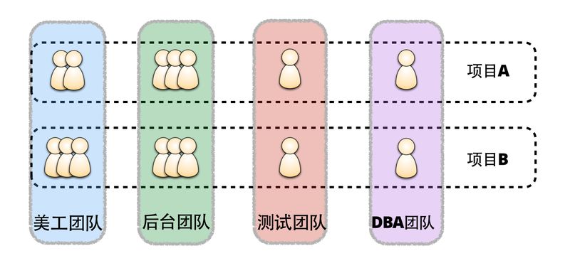

#关注产品而非项目

传统的应用大部分都是基于项目模式构建的。

什么是项目模式？就是当项目启动后，企业或者组织会从不同的资源池中抽取需要的资源。

譬如，开发团队中抽出一部分开发人员、测试团队中抽出一部分测试人员，以及其他不同技能团队中抽出需要的人员，组成一个项目团队，然后设置一个时间期限，团队在规定时间内完成项目，就算取得了成功。当项目结束后，所有的资源都会被释放。

对于这种项目模式，存在的弊端在于：

* 团队成员缺乏主人翁精神
* 难以制定有效的奖惩机制
* 团队成员没有归属感

微服务架构提倡的是采用产品模式构建，即更倾向于让团队负责整个服务的生命周期。从服务的分析、开发到测试、部署、运维。所有成员的个人目标和团队的目标一致，都是为了更有效、高效、以可持续性发展的方式为消费者（用户）提供业务功能。

当然团队有可能负责的是多个服务，因为最终的目标是通过多个服务的协调、组合实现产品的功能，以及传递价值。

大家熟知的亚马逊CTO Werner Vogels，曾经说过一句经典的名言，“You build it, you run it”。
对团队而言，产品就是团队的，也是每个成员的。团队中的每个人都有责任、有义务确保产品的快速发展以及演进。
