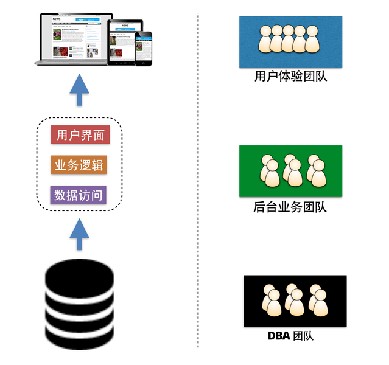

# 围绕业务组织团队

在单块应用架构的时代，为了节省成本、提高人员效率，企业或者组织一般都会根据技能的类型来划分团队。

譬如，用户体验设计师一般都被划分到用户体验设计团队，而懂服务器端的开发人员，一般都被归类为后端业务逻辑开发团队；精通数据库技能的开发者，一般会在DBA团队中找到他们的身影。当团队被按照这个策略或者维度划分后，即便是某些简单的需求变更，都有可能出现跨组织、跨团队的协作，沟通协作成本很高。
  
如[康威定律（Conway’s law)](http://en.wikipedia.org/wiki/Conway's_law)所述，一个组织的设计成果，其
结构往往对应于这个组织中的沟通和组织结构。

微服务架构下的团队组织方式不同于传统，它提倡围绕业务为核心，按业务能力来组织团队，团队中的成员具有多样性的技能。

换句话说，团队是一个以业务交付为目标的全功能团队。
