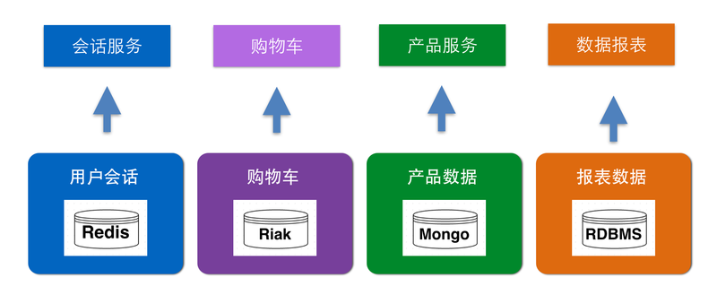

# 独立业务数据

传统的单块应用架构，倾向于采用统一的数据存储平台来存储所有的数据。

随着业务的快速发展，需求的不断变化，一方面，数据变得越来越复杂，难以管理；另一方面，随着应用系统的业务逻辑不断更新和发展，数据库不仅承担着数据存储的作用，还承担着不同系统之间的集成作用。

同时，传统的数据库大多是关系型数据库，存储的数据都是以结构化信息为主，但随着互联网的快速发展，数据的结构并不具有确定性，或者说结构发生变化的频率非常快，因此，对于如何有效维护业务数据，也成了一个难题，相应的维护成本越来越高。

微服务架构，提倡具有业务属性的独立单元或者服务自管理其相关的业务数据。这样的话，有几个非常明显的优势：
首先，具有业务属性的服务单元能够有权利管理其相关的数据，同时能够随着业务的发展，不断更新业务数据。

其次，每个业务单元只关心自己的业务数据，因此可以选择最合适的工具或者产品来存储以及管理数据。譬如可以根据具体业务场景，使用MySQL、PostgreSQL等关系型数据库，也可以使用文档类型的MongoDB、键值类型的Riak等NoSQL数据库。譬如，在一个复杂的电商系统中，产品数据的种类繁多，更新也比较频繁，如果使用类似MongoDB这种文档数据库，能灵活的根据需求动态调整结构。而像当用户访问系统时产生的会话信息，则可以使用Redis等键值系统进行存储；通常来说，报表数据的结构变化不大，而且要求数据的高一致性，因此可以使用熟悉的关系型数据库。

