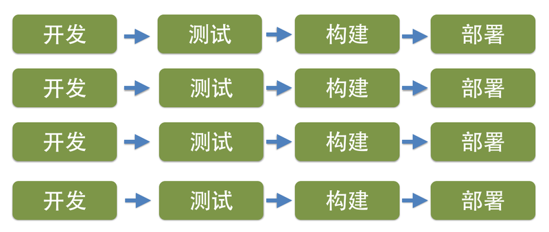

# 基础设置自动化

随着云技术的大规模推广与使用，部署和运维的复杂度在大幅度降低。利用云，我们可以快速的创建系统需要的资源，降低应用的交付周期。

同时，由于持续集成、持续交付等实践的深入人心，很多团队都开始在构建软件的过程中，使用持续交付提倡的基础设施自动化技术（更多关于持续交付的知识，请参考《持续交付-发布可靠软件的系统方法》一书）。

微服务架构将应用程序本身分成多个小的服务，每个服务都是一个独立的部署单元。因此，传统只需要部署一次就能上线的单个应用，采用微服务架构后，将需要对不同的每个服务执行部署。

因此，微服务的实践，对持续交付和部署流水线要求非常高。微服务的粒度越细，就意味着需要部署的业务单元就越多，业务单元越多，就需要更稳定的基础设置自动化机制，能够创建运行环境，安装依赖，部署应用等。

