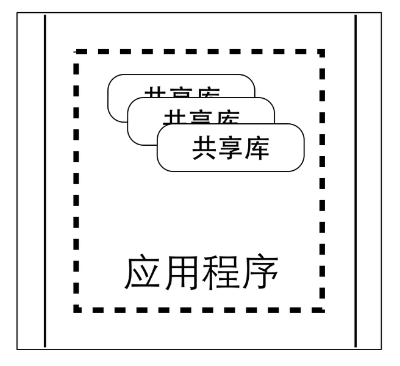

# 服务与组件

我们知道，汽车由不同的零部件组成，当某个零部件出现故障了，修理中心能使用不同的零部件替换。
换句话说，汽车的每个零件都是可以独立升级、独立替换的，有着非常好的灵活性和替换性。

在软件领域，一直以来，我们也提倡使用组件（Component）的方式，将应用模块化并为其构建相对独立的单元。

传统实现组件的方式是隔离独立的部分、或者抽取公用的部分，构建共享库（Libaray），从而达到解耦和复用的效果。不过，对于共享库而言，通常它是语言相关、平台相关，并且是和应用程序运行在同一个进程中的。

因此，共享库的变化就意味着整个应用也要被更新，并且需要被重新部署。如果应用由多个共享库组件组成，那么任何库的变更都将导致应用重新发布。

其实，微服务也可以认为是一种组件。如果把微服务作为组件，则同传统使用组件方式最大的区别是组件可以被独立部署。

譬如说，应用由多个共享库组成，并且跑在一个进程中，那么任何共享库的变更都将导致整体应用的重新发布。但如果应用由多个服务构成，并且服务是独立的，则大部分情况下，每个服务的变更仅需要部署自身，并不会影响其他服务。

因此，微服务架构的一大目的，是为了以松散的服务方式，构建模块化的应用。同时，将服务作为组件也可以帮助我们明确的定义出组件的边界，因为服务之间的调用是跨进程的，清晰的边界和职责定义应该是在设计阶段时必须考虑的。

把服务当成组件的另外一个优点是在组件和组件之间定义了清晰的、语言无关、平台无关的接口。许多开发语言虽然定义了良好的公共调用接口，也提供了详尽的文档和规范说明，但由于共享库其本身的特性，充分依赖于特定平台、特定语言，因此组件间的耦合度较高。

同共享库相比，微服务是通过语言无关、平台无关的轻量级通信机制协作，因此灵活性非常高。当然，使用微服务也有它的不足之处，就是分布式调用比进程内调用更消耗时间，并且严重依赖于网络的可靠性与稳定性。