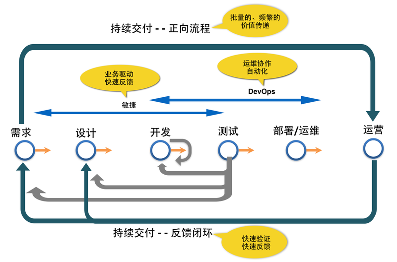

# 持续交付的核心

对于任何一个可交付的软件来说，必然要经历需求、设计、开发、测试、构建、部署、运维的过程。

针对这个过程，如果我们能建立一套流水线，帮助组织或者企业在整个软件交付的过程中缩短周期，就能提高价值传递的效率；

基于流水线，如果能有意识、有针对性的的增强或者提高自动化程度，就能降低人为出错的概率，节约成本。

如果能够通过有效监控、运维和运营，积极从用户获取反馈，就有利于形成一个良性的、有效的反馈闭环。

基于这个反馈闭环，如果能从业务、技术上，将软件的价值批量的、频繁的在流水线上传递，这就是我们谈到的持续交付。

因此，持续交付的核心在于：

- 小批量价值流动
通过交付流水线，将业务功能以小批量的方式，从需求产生端移动到用户端，快速产生价值。

- 频繁可发布
通过建立自动化的构建机制以及部署流水线，让价值频繁的从需求端传递到用户端。

- 快速实验反馈
通过在交付流水线上建立反馈机制，快速验证需求。同时根据反馈，及时指导者团队调整策略，优先做高价值的事。
	  			

	  			

持续交付让特性在整个软件交付过程中以小批量方式在各角色间顺畅地流动，通过更频繁的低风险的发布快速获得用户反馈，以此来持续达成业务目标。
