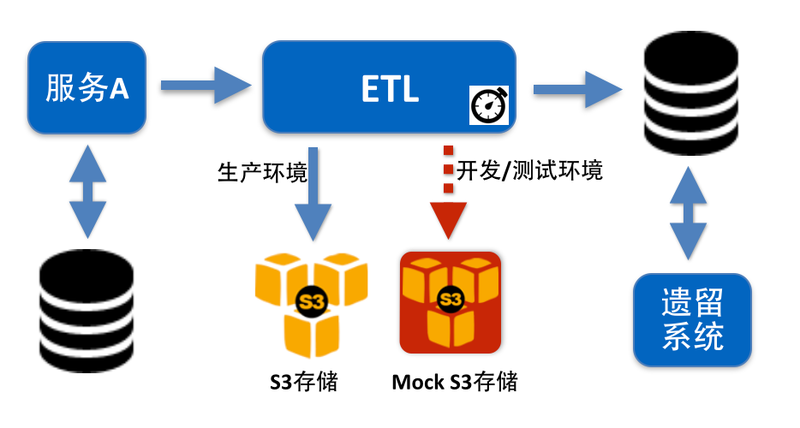

# 开发

从持续交付的角度出发，对于微服务架构，我们在开发阶段需要做到如下几点：

## 独立代码库

对于任何一个服务而言，其代码库和其他服务的代码库从物理上应该是隔离的。所谓物理隔离，其实就是指代码库本身互不干扰，不同的服务有不同的代码库访问地址。
换句话说，对于我们平时使用的SVN、GIT等工具，每个服务都对应、且只对应一个独立的代码库URL。

根据服务划分代码库的最大好处在于当前服务的代码修改后，丝毫不用担心影响其他代码库中的功能。而且，针对每个代码库，都有独立的介绍，描述当前服务的职责。

## 代码所有权归团队

团队的任何成员都能向代码库提交代码，做到服务代码的所有权归团队。

## 有效的版本管理工具

代码版本管理工具早已经不是什么新鲜玩意，最好能使用分布式版本控制类工具(DVCS，Distributed Version Contrl System)，譬如Git、Mercurial等，代替传统的集中式版本控制（CVCS，Centralized Version Control System）工具，避免由于客户端不能连接服务器所带来的无法提交代码的问题。

## 静态检查工具

同时，还需要有代码静态检查工具，譬如Java语言的CheckStyle、Ruby语言的Rubocop等。

另外，还需要有代码度量(Code metrics)工具，譬如常用的SonarQube、或者Ruby中的Cane，来保障团队内部代码的一致性和可维护性。

## 易于本地运行

作为团队的开发人员，当我们从代码库检出（Check out）某服务的代码后，应该花很短的时间、很低的成本就能在本地环境将服务运行起来。如果依赖于外部资源，并且构建、使用成本较高，就应该考虑采取其他打桩的机制来模拟这些外部资源。这类外部资源通常指数据库、云存储、缓存、或者第三方系统等。

譬如，笔者最近参与的一个企业内部系统改造项目，使用了[OKTA](https://www.okta.com/)集成单点登录的功能。开发环境下当然也可以使用OKTA，但由于网络、安全、审批等多种原因，极大的影响了开发人员在本地环境访问OKTA的效率。最后，团队采用打桩的机制，构建了一套符合OKTA协议的Mock OKTA。在开发环境下，通过加载这个Mock OKTA，有效的解决了本地访问所浪费的时间。

另外一个例子，是笔者在系统中使用了AWS的S3服务。由于权限、网络等多种因素的存在，本地开发时使用S3的成本非常高，因此就构建了一套模拟的S3环境。当服务运行在开发环境时，加载开发模式的环境变量，访问本地的Mock S3环境，而在生产环境，则使用生产模式的S3地址。在不改变任何代码的前提下，帮助团队快速在本地搭建运行环境并演示，极大的提高了开发效率。
	

