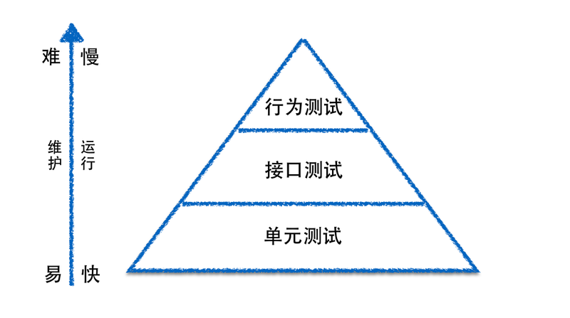

# 测试

## 集成测试的二义性

 对于任一个服务而言，单元测试当然是必不可少的。但是否需要集成测试，团队可以根据喜好自行决定。笔者个人不太喜欢使用集成测试，因为“集成”这个词，很难有一个准确的度量机制。到底什么样的组合才叫集成？其可以是对外部不同系统之间的测试组合，也可以是系统内部实现逻辑、类与类之间调用的组合，因此，‘集成测试’这个术语，在团队、组织内部，非常容易在沟通过程中产生误解。     

## Mock与Stub

通常，对于单元测试而言，我们可以通过使用Mock框架（譬如Java的Mockito、Ruby的RSpec等），帮助我们使用Mock或者Stub方式，处理单元内部对其他对象的依赖。当然如果对象之间的依赖构建成本不高，也可以使用真实的调用关系而非Mock或者Stub机制。关于Mock或者Stub的区别，有兴趣的读者可以参考ThoughtWorks首席科学家马丁.福勒的这篇文章。[ Mocks Aren’t Stubs ](http://martinfowler.com/articles/mocksArentStubs.html)

## 接口测试

除了单元测试覆盖代码逻辑外，至少还应该有接口测试来覆盖服务的接口部分。（这里我们提到的服务，是指后端的API部分，并不考虑前端和用户交互的部分，这类应用通常都是前后端分离的应用）。对于服务的接口测试而言，更关注的是接口部分。譬如，作为数据的生产者，接口测试需要确保其提供的数据能够符合消费者的要求。作为数据的消费者，接口测试需要确保，从生产者获取数据后，能够有效的被处理。另外，对于服务与服务之间的交互过程，最好能设计成无状态的。

## 测试的有效性

如果单元测试的覆盖率够高，接口测试能有效覆盖服务的接口部分，那么基本上保障了服务所负责的业务逻辑以及和外部交互的正确性。当然，有些朋友可能会存在疑问，是否需要使用行为测试的这类框架，譬如Cucumber、JBehave等，基于不同的场景，做一些类似用户行为的测试呢？

答案是：不一定。在笔者参与的项目中，通常都不建议做这类的行为测试，原因有几点：

- a）通常我们所说的服务，大多是不涉及用户交互的部分。也就是说，作为服务，更关注的是数据状态的改变，而不是同用户的交互过程。譬如，当我们从电商网站挑选某件商品、下单，一个新的订单就生成了。这个时候，订单的状态可能是‘New’。随后，当我们对订单完成付款，那么订单的状态可能会被更新成‘Payed’。如果忽略状态更新的实现流程，譬如同步更新、异步更新等，那么从服务的角度而言，其并不在意用户到底是从PC端的浏览器，还是手机上的APP来完成订单的支付，服务自身只完成了一件事：就是完成订单状态从‘New’到’Payed’的更新。

- b）服务作为整个应用系统的一部分，能够独立存在，那必然有其对应的边界条件。前面提到，单元测试保障内部逻辑，接口测试保障外部接口，在这样的前提下，服务的正确性和有效性大部分情况下已经得到了验证。

- c）从经典的测试三角形来看，越是偏向于用户场景、行为的测试，其成本越高，反馈的周期也越长；相反，越是接近代码级别的测试，成本越低，反馈周期也相对较短。

