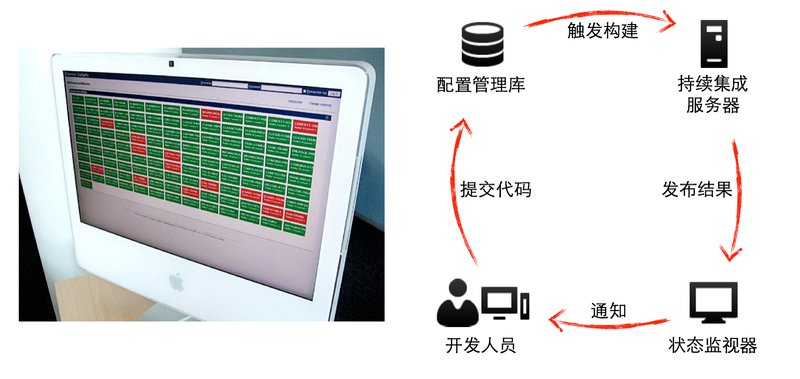

# 持续集成与构建

## 持续集成

[持续集成](http://www.martinfowler.com/articles/continuousIntegration.html)经过多年的发展，早已成为系统构建过程中众所周知的最佳实践之一。对于每个独立的、可部署的服务而言，也应当为其建立一套持续集成的环境（CI Project）。

当团队成员向服务的代码库/配置管理库提交代码后，持续集成环境会检测到代码变化，执行静态检查、代码度量、运行测试以及完成构建的步骤，如下图所示。

常用的企业级持续集成服务器有Jenkins、Bamboo以及GO等，在线的持续集成平台有Travis、SnapCI等。

## 构建

每个服务都是一个可独立部署的业务单元，经过静态检查、代码度量、单元测试、接口测试等阶段后，构建符合需求的部署包。

部署包存在的形式是多种多样的，可以是dep包、rpm包，能在不同Unix操作系统平台直接安装；也可以是zip包，war等，只需将其拷贝到指定目录下，执行某些命令，就可以工作。

当然，也有可能是基于某特定的IAAS平台，譬如亚马逊AWS、或者阿里云等，构建的包含操作系统以及内部运行环境（Ruby运行环境、Java运行环境）的映像包（Image）。

Docker现在火的发红发紫，从传统软件企业到互联网企业，从商业巨舰到初创公司，大家都饱含热情的投入到这个充满想象力的技术中来。俗话说：外行看热闹，内行看门道；在表面热闹的背后我们要探索如何把Docker从充满想象力的技术转化为先进的生产力。本文根据本人在云行业（暂时这么称呼吧）的感知和对客户在云时代的困惑和痛点的理解来和大家一起探索一下Docker的未来发展方向。

[Docker](https://www.docker.com)是一种基于Linux容器（LXC）的虚拟化技术。通过使用Docker，我们可以方便的构建基于Docker的部署镜像包。

因为Docker可以运行在任意的平台上，包括物理机、虚拟机、公有云、私有云、个人电脑、服务器等，这种兼容性使的我们可以不用担心生产环境的操作系统或者平台的差异性，只要其安装了Docker环境就好。

同时，Docker的所有修改都能以增量的方式被分发和更新，更容易实现高效的包构建以及管理机制。

