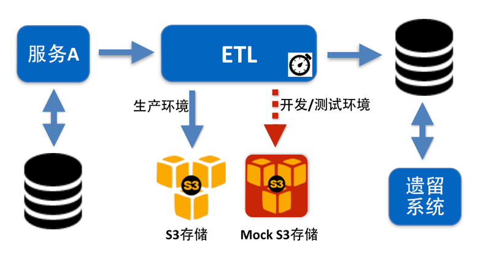

# 运维

由于每个服务都是一个可以独立运行的业务单元，同时每个服务都运行在不同的独立节点上。因此，需要为服务建立独立的监控、告警、快速分析和定位问题的机制。我们将它们统一归纳为服务的运维。

## 监控

监控是整个运维环节，乃至服务生命周期中非常重要的一环。监控通常分为两类：系统监控与应用监控。系统监控关注服务运行所在节点的健康状况，譬如CPU、内存、磁盘、网络等。应用监控则关注服务本身以及其相关依赖的健康状况，譬如服务本身是否可用、其依赖的数据库是否能正常访问等。

对于笔者参与的项目，服务节点的运行环境大都是基于AWS（使用EC2、ELB以及ASG等），使用AWS的CludWatch作为系统监控工具的情况比较多。关于应用监控，项目的产品环境从数据中心迁移到AWS之前，一直使用NewRelic、Nagios作为监控工具。关于监控，目前业界已经有很多成熟的工具，譬如Zabbix、NewRelic、OneAPM等。

## 告警

告警是运维环节另外一个重要的部分。当系统出现异常时，通过合适的告警机制，能及时、有效的通知相关负责人，做到早发现、早分析，早修复。针对每个服务，都应该提供有效的告警机制，确保当某服务出现异常时，能够准确有效的通知到责任人，并及时解决问题。这类工具较有名的是PageDuty，它支持多种提醒方式，譬如屏幕显示、电话呼叫、短信通知、电邮通知等，而且在无人应答时还会自动将提醒级别提高。

## 日志聚合

除此之外，日志聚合也是运维部分必不可少的一环。由于微服务架构本质上是基于分布式系统之上的软件应用架构方式，随着服务的增多、节点的增多，登录节点、查看日志、分析日志的工作将会耗费更高的成本。通过日志聚合的方式，能有效将不同节点的日志聚合到集中的地方，便于分析和可视化。目前，业界最著名的日志聚合工具是Splunk和Logstash，不仅提供了有效的日志转发机制，还提供了很方便的报表和定制化视图。

