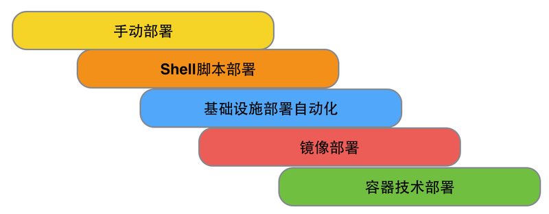

# 部署

对于每个独立的服务而言，都需要一个隔离的环境来做部署。这个环境可以是传统的数据中心的节点或者虚拟机，也可以是当下各种云平台。下面，我们就来看看当谈到部署环境时，通常会存在哪几种不同类型的环境，以及针对不同环境，会有什么样的部署方式。

## 部署环境

通常情况下，部署的环境主要有如下几类：

### 基于云平台

我们知道，云平台是个很大的范畴，其中主要包括IAAS、PAAS和SAAS三层。所以，当我们基于云平台做部署的时候，要先分清楚部署的环境，即部署将发生在哪一层。这里，笔者并没有特意区分是公有云还是私有云（公有云是指有企业外部的供应商提供云服务，私有云则是企业内部自行搭建云平台），因为所谓的公有云或者私有云，其最大的区别在于平台的提供方不同。当然，背后的需求可能是基于数据的安全性，或者组织或者企业的自主性等因素考虑。但是，如果只是从使用云的角度出发，公有云和私有云，对于待部署的目标系统而言，没有本质区别。

- 基于IAAS平台

在IAAS平台上，我们管理的是基础资源，譬如服务器节点、网络、负载均衡器、防火墙等，因此对于每次部署所构建的部署包，实际上是一个操作系统的镜像（通常，我们称为image），镜像里已经包含了运行服务所需要的基本环境，譬如JVM环境、Tomcat服务器或者Ruby环境、Passenger配置等。当我们在IAAS层部署服务时，不仅可以使用镜像创建新的节点，而且也可以创建其他系统相关的资源，譬如负载均衡器、防火墙、分布式缓存的建设等。目前常用IAAS平台，有亚马逊的AWS，阿里云、青云等。

- 基于PAAS平台

在PAAS平台上，我们并不关心基础资源的管理，PAAS平台已经帮我们考虑好如何分配合适的资源了。这时候我们更关注的是服务本身。因此，对于每次部署所需要的部署包，可以是dep包、rpm包，或者类似能直接在Unix操作系统平台安装的二进制包；也可以是zip包，war等，只需拷贝到制定目录下，启动相关容器，就可以直接工作。另外，也可以使用PAAS平台提供的工具，直接对当前的代码库完成部署。譬如，Heroku提供的命令行，就能很容易的将Rails的代码库部署到产品环境中去。

     
- 基于SAAS平台

SAAS平台指的是相对于应用软件的使用者而言，软件即服务。是指对使用者而言，不需要再去考虑本地安装、维护等因素，直接通过在线的方式享受服务，这和我们讨论的部署环境没有关系。

### 基于数据中心

云计算已经成为大家公认的未来的趋势之一，但是对于很多传统的企业，由于组织或者企业内部多年业务、数据的积累，以及组织架构、团队、流程固化等原因，无法从现有数据中心一步迁移到云端。针对传统的数据中心，其对应的环境通常比较复杂，既没有IAAS那种按需创建资源的灵活性，也没有PAAS这种资源能够被自动化调配的可伸缩性。

### 基于容器技术

容器技术，是一种新的虚拟化技术。
Docker是容器技术的典型代表。由于Docker可以运行在任意的平台上，包括物理机、虚拟机、公有云、私有云、服务器等，这种兼容性使的我们可以不用担心生产环境的操作系统或者平台的差异性，能够很方便的将Docker的镜像部署到Docker的环境中即可。
同时，由于Docker的修改都能以增量的方式被分发和更新，因此在部署、启动新服务过程中所耗费的时间更短。换句话说，采用Docker的镜像进行部署，能有效减少部署过程导致的停机时间。

## 部署方式

部署方式，是指通过什么样的方法将服务有效的部署到相应的环境。对于服务而言，由于部署环境的不同，采用的部署方式自然也不同。

### 手动部署
	
最早的部署方式，通常都是SSH到目标机上（这时的目标机通常是数据中心的物理节点或者虚拟机），下载需要的部署包，拷贝到指定的位置，重启服务。

### 使用脚本部署

由于部署团队每次都要手动下载、拷贝，不仅效率低、而且人为出错概率大。如果能使用Shell脚本，将这些下载、拷贝、重启等过程逐渐的自动化起来，就能大幅度提升效率。
Shell脚本的优势是兼容性好。但其弊端在于实现功能所需要的代码量大，可读性也较差，时间长了不易维护。

### 基础设施部署自动化（Infrastructure As Code）

随着业务的发展，很多组织以及团队已经意识到，环境的安装和配置所耗费的成本越来越高。基础设施部署自动化（Infrasture As Code）概念的提出，正好能有效的解决这一类问题。于是，越多越多的组织开始尝试使用Chef/Puppet/Ansible等类似的工具，完成软件环境的安装和配置，以及应用或者服务的部署。

### 镜像部署

私有云、公有云的出现，使得部署方式发生了显著的变化。

由于面对的环境不一样，因此部署包也不一样。以前的war包，rpm包，在云平台的IAAS上，都变成了镜像。譬如，如果使用亚马逊的云环境，则可以使用其提供的系统镜像(AMI)来完成部署。

另外，利用容器技术，譬如Docker，构建出的部署包也是一个镜像。该镜像能运行在任何Docker的环境中，有效的解决了开发与部署环境不一致的问题。同时，由于Docker是基于Linux容器的虚拟化技术，能够在一台机器上构建多个容器，因此也大大提高了结点的利用率。

无需过多的人工干预、一键触发即可完成部署的自动化方式可以说是任何公司，从上至下，从业务、开发到运维都希望达成的目标，但说起来容易，做起来难，这也不是一蹴而就的过程，需要随着组织或者企业、在业务的演进过程中，随着技术的积累逐渐自动化起来的。

所以，就微服务架构本身而言，如何有效的基于部署环境、选择合适的部署方式，并完成自动化部署，是一个值得团队或者组织不断探讨和实践的过程。

