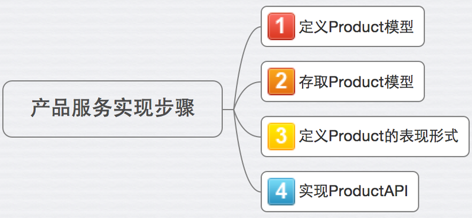

# 代码实现

接下来的部分，笔者将以Ruby语言为例，实现该产品服务的功能。

在开始动手之前，我们先将产品服务的实现划分成几个小任务（task），如下所示：



将复杂的、庞大的工作拆分成小的任务，一方面便于团队跟踪进度，另外一方面也能帮助团队在单位时间内聚焦某一个任务。

### 1.定义模型

第一步，定义业务模型。
对当前例子而言，模型很简单，只是一个Product类，具有一些属性，如下所示：

```
class Product
  include Virtus.model

  attribute :id, Integer
  attribute :name, String
  attribute :price, Float
  attribute :category, String
end
```

在当前的例子中，我们使用[Virtus](https://github.com/solnic/virtus)来定义模型的属性。
Virtus是使用Ruby语言实现的一个Gem，支持对属性的类型，默认值等进行定义，同时能方便的定义属性的约束条件。

### 2.存储模型

第二步，完成模型的存取。

我们知道，大部分应用程序都需要存储的功能。应用场景不同，存储的类型也存在很大差异，譬如关系型数据库适合存储持久化的结构化信息，NoSQL适合存储非结构化信息，文件系统适合存储临时信息，如锁文件等，而云存储（非云计算）则适合用来存放图片、资源等静态文件。

在笔者的实践中，模型的存取通常使用模型存储模式(Repository Pattern)来实现。

模型存储模式最早由埃里克·伊文思在他的《领域驱动设计》一书中提到，其最大优势在于屏蔽了模型信息的存储实现细节，让调用者更关注接口部分。

在当前的例子中，笔者使用[rom-sql](https://github.com/rom-rb/rom-sql)来完成Product信息的存储以及获取。由于是示例，省去了关于数据连接以及配置等部分的处理，具体代码如下所示：

```
class ProductRepository
  class << self
    def find(id)
      relation.as(:products).find(id).first || raise(Error, 'Product not found')
    end

    private
    def relation
      Database.db.relation(:products)
    end
  end
end

```

这里，Database.db.relation(:products)以Hash的方式读取数据库products表中的所有数据，as(:products)则把Hash映射成对应的Product对象。

另外，我们需要对rom-sql的relation以及数据库和model之间的映射进行配置，基本配置如下：

```
def self.setup_relations(rom)
  rom.relation(:products) do
    def find(id)
      where(id: id)
    end
  end
end

def self.setup_mappings(rom)
  rom.mappers do
    define(:products) do
      model ProductService::Product
    end
  end
end

```

对于当前产品服务的例子而言，数据的存取相对比较简单。对于某些复杂的情况而言，还应该考虑安全性、读写比、可伸缩性等，这时候就会用到命令查询职责分离(Command Query Responsibility Segration)。

> 
#### 什么是命令查询职责分离（Command Query Responsibility Segration）？
在三层架构中，通常是通过数据访问层来修改或者查询数据，在这种情况下，对数据的读写针对的都是同一个业务模型。随着系统业务逻辑变得复杂，访问量的增加，这种设计可能会出现性能、安全、可伸缩性等问题。虽然我们可以通过在数据库层面进行读写分离，解决类似的问题。但如果只是数据库读写分离，业务上读写依旧混合的话，随着业务的复杂度增加以及变化频率的加快，依然会出现难以维护、灵活性不高、甚至性能问题。因此，操作和查询的分离能有效的从业务上将数据的修改和数据的获取职责分离，通过从业务角度区分数据读写，而提高系统的性能、可扩展性和安全性。
更多关于CQRS的细节，请参考马丁.福勒的这篇[CQRS文章](http://martinfowler.com/bliki/CQRS.html)


> 
#### 模型存储模式（Repository Pattern）与数据访问层（Data Access Layer）的区别?
模型存储模式是领域驱动设计中的概念，它强调如何基于业务的需求实现模型的存储，它是一种抽象的设计方法。例如，模型有可能被存储到关系型数据库、NoSQL、文件系统、云存储等，也有可能作为其他服务的输入，继续被处理。
模型存储模式中定义的功能要体现领域模型的意图和约束。使用模型存储模式，隐含着一种思想，就是领域模型需要什么，它才提供什么，不需要的功能、不该提供的功能就不要提供，一切都是以业务需求为核心。
数据访问层则更关注数据的存储方式以及存储功能的实现，并不严格受限于业务逻辑。使用数据访问层，其意图在于其能够提供数据访问的所有接口，业务逻辑层需要用哪个数据接口，可以由业务层根据场景来自由选则。
使用模型存储模式的另外一个优势在于，当依赖的环境构建或者访问成本很高时候，能有效的对数据的存储或者获取的行为做Mock。几个月前，笔者就遇到类似的问题，由于业务需求，需要将某些模型的数据存储到亚马逊的云存储S3上，但由于网络延迟、安全、权限等因素，访问该环境所耗费的成本非常高。为了不让这部分功能影响团队本地的开发，团队就使用Mock的方式，构建一个假的模型存储，使得调用者能够有效的访问该接口并且迅速获取数据。
如果想了解更多关于数据访问层（DAL）与模型存储模式（Repository Pattern）的区别，推荐读者仔细阅读《领域驱动设计》中关于模型存储模式的部分。


> 
#### 模型存储模式（Repository Pattern）与对象关系映射（Object Relation Mapping）的区别?
对象关系映射，是随着面向对象的开发方法和关系型数据库的发展，而诞生的一种将对象和关系型数据库进行映射的开发方法。我们知道，对象和关系数据是业务模型的两种表现形式，业务模型在内存中表现为对象，在数据库中表现为关系数据。因此，对象关系映射一般以中间适配的形式存在，完成对象到关系数据库数据、或者关系数据库数据到对象的转换。
因此，对象关系映射可以理解成基于模型存储模式，对关系数据库访问的一种实现方式。

如上所示，我们通过ProductRepository成功的存储并获取Product的记录。


### 3.定义表现形式（Representer）

表现形式通常是用来描述业务模型如何在应用层显示。大多数情况下，表现形式包括两部分内容：

- 1）业务模型里的数据如何在应用层表现出来。
  这部分和几年前提出的DTO(Data Transfer Object）类似。通过适配器，将业务模型的数据转换成表现层需要的数据。

- 2）定义消费者（服务）如何同生产者（服务）交互，交互的协议和格式遵循什么样的规范。
  例如在HTTP协议中，使用什么样的Header，Content-type，Accept-type等。

在当前的例子中，笔者使用基于REST之上的HAL协议作为服务间（也就是消费者与生产者间）通信的规范，并使用[roar](https://github.com/apotonick/roar)对数据进行转换和渲染。

更多关于HAL的部分，请参考《不仅仅是REST一章》。

#### Product明细表现形式

对于Product明细对应的表现形式，代码实现如下所示：

```
module ProductRepresenter
  include Roar::JSON::HAL
  include Roar::Hypermedia
  include Grape::Roar::Representer

  property :id
  property :name
  property :price
  property :category

  link :self do |opts|
    request = Grape::Request.new(opts[:env])
    "#{request.base_url}/products/#{id}"
  end
end

```

在上面的ProductRepresenter中我们声明了id, name, price, category以及self link, 最终Product明细的内容如下所示:

```
{
     "id": 1,
     "name": "Microservice In Action",
     "price": 123.4,
     "category": “Book",
     "_links": {
          "self": {
          "href": "http://localhost:9292/products/1"
          }
     }
}
```

#### Product列表表现形式

对于Product列表对应的表现形式，代码实现如下所示：

```
module ProductsRepresenter
  include Roar::JSON::HAL
  include Roar::Hypermedia
  include Grape::Roar::Representer

  collection :entries, extend: ProductRepresenter, as: :products
end
```

在上面的ProductsRepresenter中，我们使用collection定义响应的结果为一组资源。
同时，定义每个资源的内容都为ProductRepresenter的输出。

```
{
  "products": [
    {
       "id": 1,
       "name": "Microservice In Action",
       "price": 59.00,
       "category": “Book",
       "_links": {
            "self": {
            "href": "http://localhost:9292/products/1"
            }
       }
    },

    {
       "id": 2,
       "name": "Building microservice",
       "price": 100.00,
       "category": “Book",
       "_links": {
            "self": {
            "href": "http://localhost:9292/products/2"
            }
       }
    }
  ]
}
```


### 4.实现api

最后，我们需要构建api，为使用者提供管理产品信息的接口。

这里的api主要用来接收请求、调度处理逻辑并返回响应结果，和我们所熟悉的传统WEB框架中的controller作用类似，譬如Spring MVC的controller，Rails框架中的controller等等。

在当前的例子中，笔者使用[Grape](https://github.com/intridea/grape)（由Ruby语言实现的基于Rack的，REST风格的框架）来实现api相关的功能，具体实现如下：

```
module ProductService
  class API < Grape::API

    # 定义默认的Content-type以及内容协商机制
    content_type :json, 'application/hal+json'
    format :json

    # 使用Roar渲染模型
    formatter :json, Grape::Formatter::Roar

    # 定义Error
    rescue_from RecordNotFoundError do |error|
      Rack::Response.new({ errors: error.message }.to_json, 404).finish
    end

    # 定义资源以及操作
    resource :products do
      get do
        present ProductRepository.all, with: ProductsRepresenter
      end

      route_param :id do
        get do
          present ProductRepository.find(params[:id]), with: ProductRepresenter
        end

        params do
          requires :product, type: Hash do
            optional :name, type: String, allow_blank: false
            optional :price, type: Float, allow_blank: false
            optional :category, type: Integer, allow_blank: false
          end
        end

        put do
          present ProductRepository.update(params[:product].merge(id: params[:id])), with: ProductRepresenter
        end

        delete do
          ProductRepository.delete(params[:id])
          body false
        end
      end

      params do
        requires :product, type: Hash do
          requires :name, type: String, allow_blank: false
          requires :price, type: Float, allow_blank: false
          requires :category, type: Integer, allow_blank: false
        end
      end

      post do
        present ProductRepository.create(params[:product]), with: ProductRepresenter
      end
    end

    get '/' do
      { '_links' => HAL::Index.links }
    end
  end
end

```

api的部分测试代码如下:

```
describe 'GET /products/:id' do
  subject { get "/products/#{id}" }

  context 'when the product does not exist' do
    let(:id) { 12345 }
    it 'should return a 404' do
      subject
      expect(last_response.status).to eq 404
    end
  end

  context 'when the product does exist' do
    let(:product) { ProductRepository.create ModelFactory.build_product_attributes }
    let(:id) { product.id }
    it 'should return the details of the product identified by the id provided' do
      subject
      expect(last_response.status).to eq 200
      expect(json_response).to be_json_of_product product
    end
  end
end

```

这里我们看到，api将我们之前定义的ProductRepository和ProductRepresenter联系了起来。当没有查到指定ID对应的产品信息时，ProductRepository会抛出RecordNotFoundError并且被api捕获，最终给调用者返回错误。

### 小结

基于上面的描述，对于产品服务实现的代码结构如下图所示:

```

├── app
│   ├── api.rb
│   ├── models
│   │   └── product.rb
│   ├── repositories
│   │   ├── product_repository.rb
│   │   └── record_not_found_error.rb
│   └── representers
│       ├── product_representer.rb
│       └── products_representer.rb

```

关于更多的代码实现以及测试，请参考本书相应的源码。
