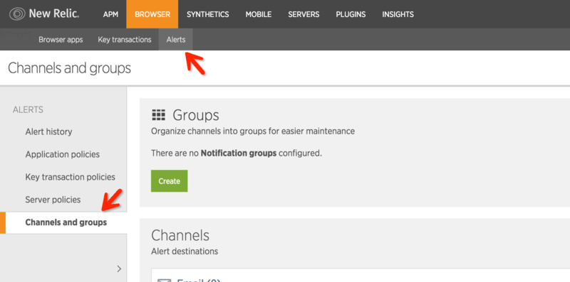

# 告警

告警是运维环节另外一个非常重要的部分。当系统出现异常时，通过合适的告警机制，能及时、有效的通知相关负责人，做到早发现、早分析，早修复。

针对每个服务，都应该提供有效的告警机制，确保当某服务出现异常时，能够准确有效的通知到责任人，并及时解决问题。

目前比较流行的告警工具有[PagerDuty](https://www.pagerduty.com/)、[Nagios](https://www.nagios.com/)等。

在笔者参与的项目中，大部分使用PageDuty作为告警工具，更多关于PageDuty的介绍以及使用，请参考相关文档。

在当前产品服务这个例子中，我们就以PageDuty作为告警工具。

>
PagerDuty是一款能够在服务出问题时发送提醒的软件。在发生问题时，提醒的方式包括屏幕显示、电话呼叫、短信通知、邮件通知等，同时还集成了[Slack](https://slack.com/)等即时消息应用，另外在无人应答时还会自动将提醒级别提高。

## PageDuty与NewRelic

上一小节中，我们介绍了使用NewRelic进行监控，那么如何将PagerDuty和NewRelic集成，确保当监控发现异常时能及时发送告警呢？

实际上，NewRelic本身已经和PageDuty集成的很好了，我们只需要按照如下步骤设置NewRelic即可：

- 登录NewRelic的控制台，点击 “Browser” -> “Alerts” -> “Channels and groups”。

- 点击“Create Channel”并选择“PagerDuty”，按照要求填写相关配置信息，即可完成PagerDuty和NewRelic的集成。

 

- 配置成功后，NewRelic的任何报警信息都会被发送到PagerDuty，并且通过邮件或者电话的方式通知到相关的责任人。
