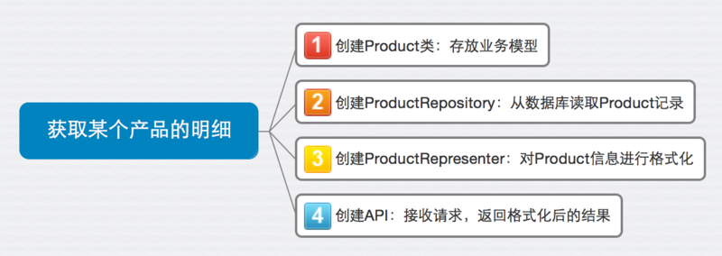

# 代码实现

这里，我们就以获取某个产品明细这个接口为例给大家介绍如何一步一步地去实现一个最简单的服务。
编程语言我们选择使用Ruby，其他语言的实现也非常类似。

为了让大家在阅读详细步骤之前对我们要做的事情有个结构性的认识，我们首先进行一个简单的tasking，也就是列出to-do list，步骤如下：




### 定义业务模型

由上图可以看出，第一步，我们需要定义model，model通常是用来存放业务模型，譬如对当前例子而言，模型很简单，就是一个Product类，具有一些属性，如下所示：

```
	class Product
	  include Virtus.model

	  attribute :id, Integer
	  attribute :name, String
	  attribute :price, Float
	  attribute :category, String
	end
```

在这个例子中，我们使用[Virtus](https://github.com/solnic/virtus)来定义模型的属性，Virtus支持对属性的类型，默认值进行定义，并且可以对属性添加一些约束条件，甚至可以进行内嵌对象或者集合的映射。

### 存取业务模型

第二步，我们要完成数据的读取，repositories通常用来封装存储，读取以及查找行为的逻辑，在笔者的实践中，该部分通常都会遵循模型存储模式(Repository Pattern)。模型存储模式是由埃里克·伊文思在他的《领域驱动设计》一书中提到，可以算是使用相当广泛的应用架构设计模式之一。

我们知道，大部分应用程序都需要存储的功能。譬如电商系统中的用户信息、产品信息、图片信息等都需要存储。应用场景不同，存储的类型也存在很大差异，譬如关系型数据库适合存储持久化的结构化信息，NoSQL适合存储非结构化信息，文件系统通常存储临时信息，如日志文件、锁文件等，而云存储（非云计算）则适合用来存放图片、资源等静态文件。

对于这些场景，模型存储模式的本质及优势在于，其屏蔽了模型的存储以及获取的实现细节，让调用者更关注接口。

在当前的例子中，笔者使用[rom-sql](https://github.com/rom-rb/rom-sql)来完成Product的存储以及获取。由于是示例，省去了关于数据连接以及配置等部分的处理。关于更详细的模型存储的例子，请读者参考案例篇里描述的其他场景的模型存储的实现方式。读取Product的代码如下：

```
class ProductRepository
  class << self
    def find(id)
      relation.as(:products).find(id).first || raise(RecordNotFoundError, 'Product not found')
    end

    private

    def relation
      Database.db.relation(:products)
    end
  end
end

```

这里，Database.db.relation(:products)能够以Hash的形式读取数据库products表中的所有数据，as(:products)会帮我们把Hash映射成对应的Product对象。当然，我们需要事先对rom-sql的relation以及数据库和model之间的映射进行配置，基本配置如下：

```
def self.setup_relations(rom)
  rom.relation(:products) do
    def find(id)
      where(id: id)
    end
  end
end

def self.setup_mappings(rom)
  rom.mappers do
    define(:products) do
      model ProductService::Product
    end
  end
end

```

对于repositories，复杂的情况还应该考虑是否在应用程序内部需要实现命令查询职责分离(Command Query Responsibility Segration)。

> 
#### 什么是命令查询职责分离（Command Query Responsibility Segration）？
在三层架构中，通常是通过数据访问层来修改或者查询数据，在这种情况下，对数据的读写针对的都是同一个业务模型。随着系统业务逻辑变得复杂，访问量的增加，这种设计可能会出现性能、安全、可伸缩性等问题。虽然我们可以在数据库层面进行读写分离的设计，来解决类似的问题，但如果只是数据库读写分离，业务上读写依旧混合的话，随着业务的复杂度以及业务变化频率的加快，依然会出现难以维护、灵活性不高以及性能问题。因此，操作和查询的分离能有效的从业务上将数据的修改和数据的获取职责分离，在业务逻辑清晰、分工明确的基础之上，提高系统的性能、可扩展性和安全性。
更多关于CQRS的细节，请参考马丁.福勒的这篇[文章](http://martinfowler.com/bliki/CQRS.html)


> 
#### 模型存储模式（Repository Pattern）与数据访问层（Data Access Layer）的区别?
模型存储模式是领域驱动设计中的概念，它强调如何基于业务的需求实现模型的存储，它是一种抽象的设计方法。例如，模型有可能被存储到关系型数据库、NoSQL、文件系统、云存储等，也有可能作为其他服务的输入，继续被处理。
模型存储模式中定义的功能要体现领域模型的意图和约束。使用模型存储模式，隐含着一种思想，就是领域模型需要什么，它才提供什么，不需要的功能、不该提供的功能就不要提供，一切都是以业务需求为核心。
数据访问层则更关注数据的存储方式以及存储功能的实现，并不严格受限于业务逻辑。使用数据访问层，其意图在于其能够提供数据访问的所有接口，业务逻辑层需要用哪个数据接口，可以由业务层根据场景来自由选则。
使用模型存储模式的另外一个优势在于，当依赖的环境构建或者访问成本很高时候，能有效的对数据的存储或者获取的行为做Mock。几个月前，笔者就遇到类似的问题，由于业务需求，需要将某些模型的数据存储到亚马逊的云存储S3上，但由于网络延迟、安全、权限等因素，访问该环境所耗费的成本非常高。为了不让这部分功能影响团队本地的开发，团队就使用Mock的方式，构建一个假的模型存储，使得调用者能够有效的访问该接口并且迅速获取数据。
如果想了解更多关于数据访问层（DAL）与模型存储模式（Repository Pattern）的区别，推荐读者仔细阅读《领域驱动设计》中关于模型存储模式的部分。


>
#### 模型存储模式（Repository Pattern）与对象关系映射（Object Relation Mapping）的区别?
对象关系映射，是随着面向对象的开发方法和关系型数据库的发展，而诞生的一种将对象和关系型数据库进行映射的开发方法。我们知道，对象和关系数据是业务模型的两种表现形式，业务模型在内存中表现为对象，在数据库中表现为关系数据。因此，对象关系映射一般以中间适配的形式存在，完成对象到关系数据库数据、或者关系数据库数据到对象的转换。
因此，对象关系映射可以理解成基于模型存储模式，对关系数据库访问的一种实现方式。

上面，我们通过ProductRepository读取了Product记录，怎么将其转换成表现层需要的格式？

representers通常是用来描述业务模型在应用层的表现形式。大多数情况下，Representer负责两部分内容：
     1）业务模型里的数据如何在应用层以数据的方式表现出来。这部分和几年前提出的DTO(Data Transfer Object)类似。通过适配，将业务模型的数据转换成表现层需要的数据。

     2）定义消费者（服务）如何同生产者（服务）交互，其协议和格式遵循什么样的规范。例如在HTTP协议中，使用什么样的Header，Content-type，Accept-type等。

在当前的例子中，笔者使用[roar](https://github.com/apotonick/roar)对数据进行转换和渲染，并使用基于REST之上的HAL协议作为服务间（也就是消费者与生产者间）通信的规范，关于更多使用HAL的实践，请参考《不仅仅是REST一章》。ProductRepresenter的代码实现如下：

```
module ProductRepresenter
  include Roar::JSON::HAL
  include Roar::Hypermedia
  include Grape::Roar::Representer

  property :id
  property :name
  property :price
  property :category

  link :self do |opts|
    request = Grape::Request.new(opts[:env])
    "#{request.base_url}/products/#{id}"
  end
end

```

由于在上面的representer中我们声明了id, name, price, category以及self link, 因此，最终生成的json结构如下:

```
{
     "id": 1,
     "name": "Lavina Schultz",
     "price": 123.4,
     "category": “Book",
     "_links": {
          "self": {
          "href": "http://localhost:9292/products/1"
          }
     }
}
```

最后，我们需要通过API将服务暴露出来，API是处理请求和响应的部分。这和我们熟悉的WEB MVC框架中controller作用类似，譬如Spring MVC的controller，Rails框架中的controller，负责接收请求，调度业务处理逻辑，并返回结果。
在当前的例子中，笔者使用Grape（由Ruby语言实现的基于Rack的，REST风格的框架）来实现api相关的功能，具体实现如下：

```
module ProductService
  class API < Grape::API
    content_type :json, 'application/hal+json'
    format :json
    formatter :json, Grape::Formatter::Roar

    rescue_from RecordNotFoundError do |error|
      Rack::Response.new({ errors: error.message }.to_json, 404).finish
    end

    resource :products do
      route_param :id do
        get do
          present ProductRepository.find(params[:id]), with: ProductRepresenter
        end
      end
    end
  end
end
```

相应的，API的测试代码如下:

```
describe 'GET /products/:id' do
  subject { get "/products/#{id}" }

  context 'when the product does not exist' do
    let(:id) { 12345 }
    it 'should return a 404' do
      subject
      expect(last_response.status).to eq 404
    end
  end

  context 'when the product does exist' do
    let(:product) { ProductRepository.create ModelFactory.build_product_attributes }
    let(:id) { product.id }
    it 'should return the details of the product identified by the id provided' do
      subject
      expect(last_response.status).to eq 200
      expect(json_response).to be_json_of_product product
    end
  end
end

```

这里我们看到，API将我们之前定义的ProductRepository和ProductRepresenter串了起来。当没有查到指定Id的记录时，ProductRepository会抛出RecordNotFoundError并且被API捕获，最终返回404错误。
