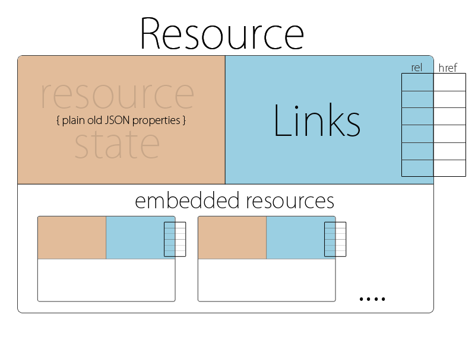

# HAL的核心

在HAL中，任何响应都被定义成一个资源（Resource），这是遵循REST的原则的。

同REST略微不同的是，在每个资源中，HAL又将其分成了如下三个部分：

- 状态      (State)
- 链接      (Links)
- 子资源    (Embedded Resource)



## 状态（State）

状态是指资源本身固有的属性。

譬如，对电商系统中的商品而言，状态可能包括商品名称、商品定价、更新时间等。对社交系统中的用户而言，状态可能包括姓名、邮箱、电话号码等。

```
product 
{
  "title": "Java In Action",
  "price" : 68.00,
  "created_at": "2015-06-01 19:00:00"
}

user 
{
  "name": "Peter",
  "email": "peter@gmail.com”,
  “phone”:  15389001234
}

```     

## 链接（Links）
     
资源的链接主要由以下几部分组成:
- 链接名称
- 目标URI
- 访问链接的可选参数，譬如内容协商（content negotiation）或者接受格式（Accept）等。

譬如，对于社交系统中的用户，其对应的链接可能包括：

``` 
{
  "_links": {
    "self":   { 
      "href": “/example.com/users/15389001234”, “title" => "profile" 
    },
    "friends": { 
      "href": “/example.com/users/15389001234/friends”, “title”:”friends" } 
    }
 	“name”: “Peter”,
  	"email": "peter@gmail.com”,
  	“phone”:  15389001234
}

```

## 子资源 （Embedded Resource）
     
子资源主要指当前资源内部，较为复杂的属性部分。
    
譬如，对于电商系统的产品，其子资源可能是产品的种类，如下所示：

```
{
  "title": "Java In Action",
  "price" : 68.00,
  "created_at": "2015-06-01 19:00:00"

  "_embedded":{
       "category": {
            "title": "book",
            "created_at" "2014-10-01",
            "books_count": 40     
       }
  }
}

```

对于社交系统，其子资源可能是用户所在的兴趣小组等，如下代码所示：

```
{
  "name": "Peter",
  "email": "peter@gmail.com”,
  “phone”:  15389001234

  "_embedded":{
       "groups": [
       {
            "title": "sports",
            "created_at" "2014-10-01",
            "count": 30     
       },
       {
            "title": "music",
            "created_at" "2015-01-01",
            "count": 30     
       }]
  }
}
```