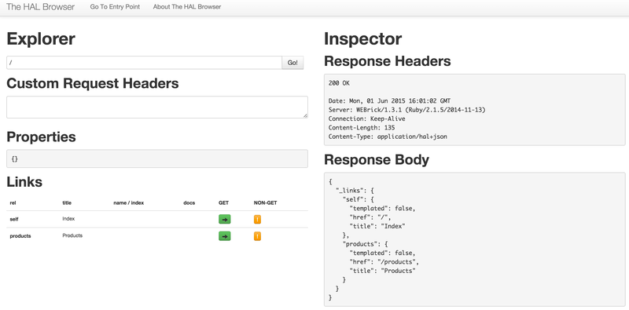

# HAL浏览器
          


使用HAL，还有一个很大的优势，那就是可以使用HAL浏览器（HAL-Browser）来可视化资源的信息。

我们知道，HAL将资源分成了三个基本的部分：状态、链接和子资源。

基于这个标准的结构，HAL浏览器能够将资源的的每一部分，通过固定格式，可视化的显示出来。



如上图所示，左边的可视化部分为HAL-Browser的展示，其主要包括：
	- 请求URL
	- 请求Header
	- 属性部分
	- 链接部分

右边为对应的响应内容，其主要包括：
	- 响应Header
	- 响应内容

在笔者参与的微服务项目中，大部分都会使用使用HAL Browser为调用者提供API功能的展示。当调用者使用浏览器访该服务的URL时，显示的第一个页面就是HAL Browser展示的关于资源部分的显示。

## HAL浏览器的使用

在实践中，我们将对HAL Browser的使用封装成了一个Gem，如下所示：

```
def call(env)
  request = Rack::Request.new(env)
  if match?(request)
    return [303, {'Location' => hal_browser_url_with_request(request)}, []]
  end
  ......
end
```

如上代码所示，当Rack请求进来时，Gem会先检查该请求是否期望被重定向到HAL Browser的显示页面。

匹配的逻辑如下所示：
```
def match?(request)
  request.get? && is_html?(request) && not_excluded?(request)
end

```

如果匹配，则请求被重定向到HAL Browser的显示页面：
```
def hal_browser_url_with_request(request)
  url = URI.parse('/hal-browser/browser.html')
  url.fragment = url_path_with_query_string(request)
  url.to_s
end

```


在代码中使用时该Gem时，我们只需要配置exlude的URI，这些资源就不会被重定向了。

```
use Rack::HalBrowser::Redirect, :exclude => ['/diagnostic', '/service-info', '/trace']

```

更多关于HAL Browser的信息以及使用，请参考HAL Browser的github[代码库](https://github.com/mikekelly/hal-browser)。
