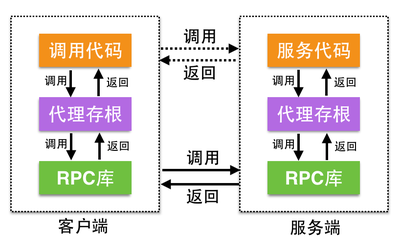

RPC采用客户端/服务器端模式。请求的发起者是客户端，提供响应的是服务器端。客户端和服务器端的交互过程主要为：

1. 首先，客户端调用本地进程，发送一个信息到服务器端，然后等待应答信息。

2. 在服务器端，服务进程保持睡眠状态，直到被调用的信息到达并将其唤醒。

3. 当一个调用信息到达后，服务器获得请求参数、处理，并发送答复信息，然后等待下一个调用信息。

4. 客户端进程接收答复信息，获得结果，调用部分代码继续执行。

通常，RPC 框架都会定义一组代理存根（客户端与服务器端），并提供透明的调用机制让调用者不必显示的区分是本地调用还是远程调用，如下图所示：

譬如，当我们使用Java语言构建分布式系统时，服务（系统）和服务（系统）之间最常用的通信机制是RMI（Remote Method Invocation），而RMI就是分布式系统间不同节点通信的RPC机制。
