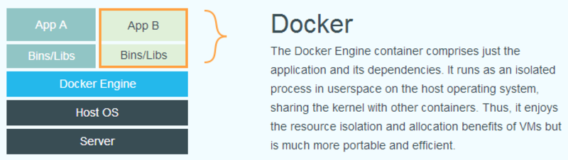
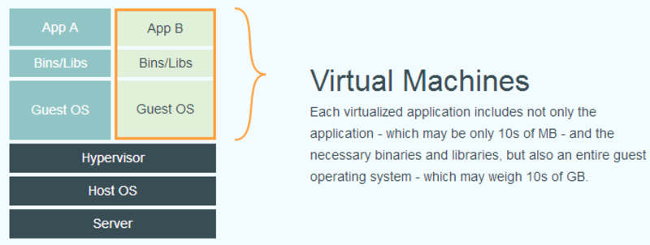

# 什么是Docker

Docker 是一个开源的应用容器引擎，其目标是实现轻量级的操作系统虚拟化解决方案。Docker的基础是 Linux容器（LXC）技术。在LXC的基础上，Docker对其进行了进一步的封装，让用户不需要去关心容器的管理，使得操作更为简便。

使用Docker，开发者能够以很低的成本，将他们的应用以及依赖包打包到一个可移植的Docker镜像中，然后无缝的在其他机器上运行。

另外，Docker完全采用沙箱机制，每个Docker容器运行在一个独立的进程中，相互之间不会有任何接口，因此Docker的隔离性非常好，可以很容易地在任何机器上运行。最重要的是,Docker镜像的运行不依赖于任何语言、框架或系统。

## Docker的起源

Docker 是一个开源项目，诞生于 2013 年初，最初是 dotCloud 公司内部的一个业余项目。它基于 Google 公司推出的 Go 语言实现。 项目后来加入了 Linux 基金会，遵从了 Apache 2.0 协议，项目代码在 GitHub 上进行维护。

Docker 自开源后受到广泛的关注和讨论，以至于 dotCloud 公司后来改名为 Docker Inc。而且，Redhat也已经在其 RHEL6.5 中集成支持 Docker；Google 也在其 PaaS 产品中广泛应用。

与此同时，Docker这项开源技术不仅仅是红帽和Canonical等Linux巨头眼里的宠儿。微软等专有软件公司也在热烈拥抱Docker。

## Docker和传统虚拟化的区别

Docker和传统虚拟化方式有着很大的不同。

以前的Hyper-V、KVM和Xen等虚拟化技术都是基于硬件的虚拟化机制，因此它们对系统的资源要求非常高。

相比而言，容器技术并不是对硬件进行虚拟化处理，而是在操作系统层面上实现虚拟化，将每个容器运行在操作系统的一个实例上。因此，这也就是意味着容器技术在系统资源的使用上比传统虚拟机要高效的多。

下面的图片比较了Docker和传统虚拟化方式的不同之处：

## 为什么要使用Docker
